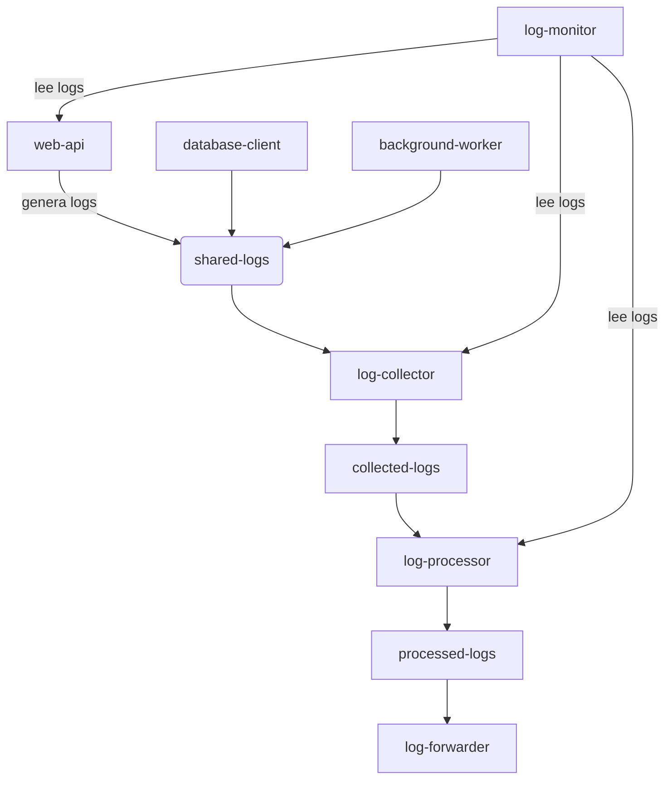

Este manifiesto de Kubernetes define una aplicación compuesta por varios componentes que trabajan juntos para ejecutar servicios, recolectar y procesar logs. Aquí te explico cada parte paso a paso:

🗂️ ConfigMap: app-scripts
```yaml
apiVersion: v1
kind: ConfigMap
metadata:
  name: app-scripts
Propósito: Almacena scripts Python como archivos de configuración.

Archivos incluidos:

web-api.py: API web principal.

database-client.py: Cliente para acceder a la base de datos.

background-worker.py: Procesos en segundo plano.

log-collector.py: Recolecta logs de los contenedores.

log-processor.py: Procesa los logs recolectados.
```

Estos scripts se montan en los contenedores como archivos accesibles en /app.

🌐 Service: logging-demo-app
```yaml
apiVersion: v1
kind: Service
metadata:
  name: logging-demo-app
```

-Tipo: ClusterIP (solo accesible dentro del clúster).
-Puerto expuesto: 8080.
-Selector: conecta con pods que tienen la etiqueta app: logging-demo.

🚀 Deployment: logging-demo
```yaml
apiVersion: apps/v1
kind: Deployment
metadata:
  name: logging-demo
```

Replicas: 1 pod.
Selector: etiqueta app: logging-demo.
Contenedores definidos:

🔧 Contenedores principales
-web-api
    -Ejecuta Flask y Requests.
    -Expone el puerto 8080.
    -Tiene probes de salud (readiness y liveness).
    -Monta scripts y logs compartidos.

-database-client
    -Usa Pandas para interactuar con la base de datos.
    -Monta scripts y logs compartidos.

-background-worker
    -Ejecuta tareas en segundo plano.
    -Monta scripts y logs compartidos.

📦 Sidecars de logging
-log-collector
    -Recolecta logs desde /logs y los guarda en /collected-logs.

-log-processor
    -Procesa los logs recolectados usando Pandas.
    -Guarda resultados en /processed-logs.

-log-forwarder
    -Usa BusyBox para imprimir reportes de logs procesados cada 60 segundos.

📁 Volúmenes
-app-scripts: montado desde el ConfigMap.
-shared-logs, collected-logs, processed-logs: volúmenes temporales (emptyDir) para compartir datos entre contenedores.

🔍 Pod: log-monitor
```yaml
apiVersion: v1
kind: Pod
metadata:
  name: log-monitor
```

Propósito: Monitorear logs de los contenedores principales.
Contenedor: usa BusyBox para ejecutar comandos kubectl logs.
Frecuencia: cada 120 segundos imprime los últimos logs de web-api, log-collector y log-processor.

🧠 Resumen del flujo
